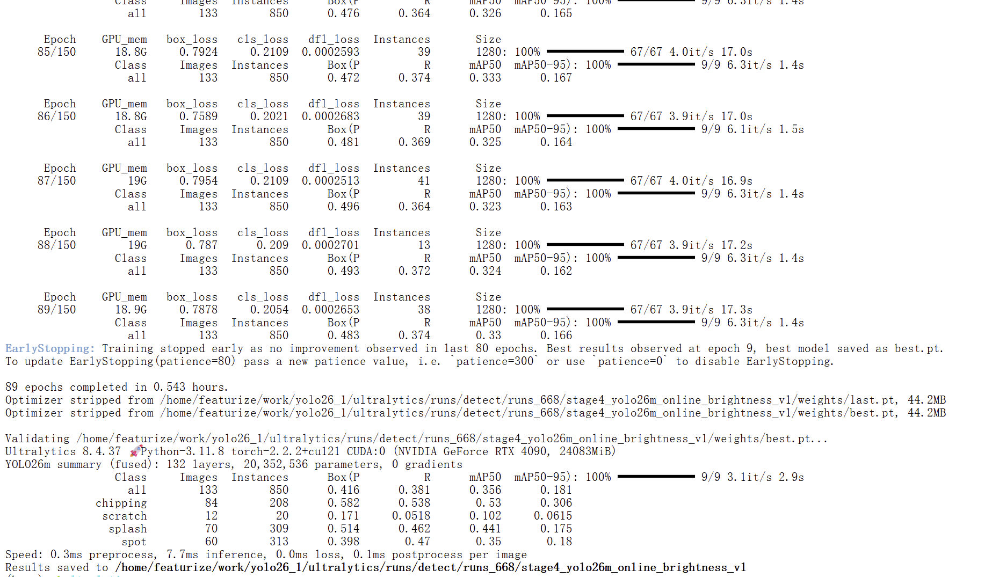
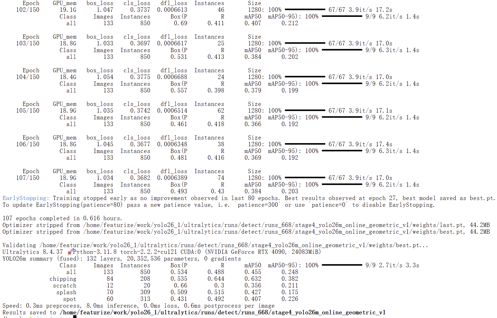

# 2026-07-28 模型训练待办清单

## 当前结论

当前检测主方案为 `stage3_yolo26m_online_lightaug_v12`：在原始数据集上使用轻量在线增强，取得目前最佳总体检测结果。

| 实验 | 数据与主要改动 | mAP50 | mAP50-95 | 结论 |
|---|---|---:|---:|---|
| 原始检测基准 | YOLO26m，1280，无增强 | 0.379 | 0.189 | 原始对照基线 |
| 高分辨率检测 | 原始数据，1536 | 0.356 | 0.183 | 未优于 1280 基准 |
| 整图 scratch 离线增强 | 复制含 scratch 图像并增强 | 0.367 | 0.187 | 不推荐，类别共同增长且 scratch 退化 |
| scratch 专项合成增强 | 仅新增 scratch 合成样本 | 0.382 | 0.180 | scratch Recall 改善，但严格定位下降 |
| 分割基准 | YOLO26m-seg，原始多边形标签 | Box: 0.357；Mask: 0.251 | Box: 0.177；Mask: 0.105 | chipping 有潜力，scratch mask 仍较弱 |
| 在线轻量增强 | 原始数据，亮度＋轻微几何变换 | **0.470** | **0.238** | 当前最佳检测方案 |

在线增强最佳模型的分类别 Box 指标：

| 类别 | Precision | Recall | mAP50 | mAP50-95 |
|---|---:|---:|---:|---:|
| chipping | 0.628 | 0.562 | 0.595 | 0.356 |
| scratch | 0.577 | 0.335 | 0.403 | 0.160 |
| splash | 0.525 | 0.497 | 0.461 | 0.195 |
| spot | 0.492 | 0.462 | 0.422 | 0.242 |

## 数据集与模型固定项

- 原始检测数据：`/home/featurize/data/yolo_dataset/data.yaml`
- 模型：`yolo26m.pt`
- 输入尺寸：`imgsz=1280`
- Batch：`batch=8`
- 训练轮数：`epochs=150`
- 早停：`patience=80`
- 优化器：`AdamW`，`lr0=0.0003`，`lrf=0.02`，`cos_lr=True`，`warmup_epochs=5`
- 统一随机性：`seed=42`，`deterministic=True`
- 每组实验只改变一个因素；全部从 `yolo26m.pt` 重新训练，禁止 `resume` 其他实验的权重。

## P0：在线增强消融（优先执行）

目标：确认当前最佳效果主要来自亮度变化还是几何变化，避免把多个因素混在一起。

- [x] **P0-A：仅亮度增强**

  ```python
  hsv_h=0.0,
  hsv_s=0.0,
  hsv_v=0.08,
  degrees=0.0,
  translate=0.0,
  scale=0.0,
  fliplr=0.0,
  flipud=0.0,
  mosaic=0.0,
  mixup=0.0,
  ```

  结果：`mAP50=0.356`，`mAP50-95=0.181`，scratch `Recall=0.085`。不保留。

- [x] **P0-B：仅几何增强**

  ```python
  hsv_h=0.0,
  hsv_s=0.0,
  hsv_v=0.0,
  degrees=2.0,
  translate=0.03,
  scale=0.10,
  fliplr=0.5,
  flipud=0.0,
  mosaic=0.0,
  mixup=0.0,
  ```

  结果：`mAP50=0.455`，`mAP50-95=0.248`，scratch `Recall=0.300`，scratch `mAP50-95=0.211`。当前检测主方案。

**结论：**几何增强是主要有效因素；`hsv_v=0.08` 的单独亮度增强不适合当前低对比度 scratch。

- [ ] **P0-C：几何增强 + 低强度亮度**

  使用 `hsv_v=0.02`，其余保持 P0-B 不变。

  运行名：`stage5_yolo26m_online_geom_hsv002_v1`

## P1：增强强度确认

- [ ] **P1：最佳在线策略的重复验证**

  使用当前完整在线增强配置，保持数据划分不变，仅将种子改为 `7` 和 `2026` 各运行一次。

  运行名：

  ```text
  stage3_yolo26m_online_lightaug_seed7
  stage3_yolo26m_online_lightaug_seed2026
  ```

  **验收条件：**记录三次的均值与标准差；若平均 `mAP50-95` 仍显著高于原始基准 `0.189`，再将在线增强确认为默认训练方案。

## P2：scratch 专项合成强度消融

当前 scratch 专项合成数据集有 156 个新增 scratch 实例：训练集 scratch 从 78 增至 234，其他类别实例数不变。

- [ ] **P2：残差融合的较低比例 scratch 合成增强**

  每个 scratch 仅生成 1 个合成样本，并使用局部残差融合替代直接像素粘贴：

  ```text
  训练 scratch：78 -> 156
  新增合成图：78
  ```

  使用与原始检测基准一致的训练设置，不叠加在线增强。

  数据集：`yolo_dataset_scratch_residual_aug`

  运行名：`stage4_yolo26m_scratch_residual_v1`

  **验收条件：**scratch `mAP50-95` 应超过当前专项合成结果 `0.060`，且总体 `mAP50-95` 不低于原始基准 `0.189`。

- [ ] **P2-后续：只在 P2 有效后测试组合策略**

  将表现最佳的 scratch 合成比例与 P0/P1 确认的最佳在线增强组合。不要直接使用“2 个合成版本 + 全部在线增强”，以免再次引入过强增强和重复样本。

## P3：分割路线验证

分割基准显示：chipping 的掩膜 mAP50 为 0.454，但 scratch 的 Mask mAP50-95 仅 0.0316；训练在第 9 epoch 即达到最好结果，存在明显过拟合。

- [ ] **P3：提高分割掩膜分辨率**

  基于原始多边形数据集运行：

  ```python
  model = YOLO("yolo26m-seg.pt")
  # 其余参数保持分割基准一致
  batch=2,
  mask_ratio=2,
  overlap_mask=False,
  ```

  运行名：`stage2_yolo26mseg_maskratio2_origin`

  **验收条件：**scratch 的 `Mask mAP50-95` 必须明显超过 `0.0316`；同时检查 `val_batch*_pred.jpg` 中 scratch 是否生成连续掩膜而非仅有检测框。

- [ ] **P3-后续：scratch-only 合成分割**

  只有当 P3 的高分辨率掩膜有效后，才使用 `yolo_dataset_scratch_only_aug` 训练分割模型；先保持 `mask_ratio=2` 与其他参数不变，以单独测试 scratch 合成数据的价值。
